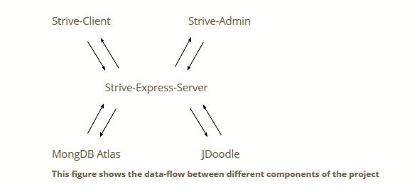

# strive-online-coding-platform
Leetcode,Hackerrank like web-application from scratch using angular and express JS

# About
Strive is a simple open source implementaion of online coding platform. It can serve as a template to for other similar applications.

#### It consists of the following components:

* Strive-Client  : This is the application achieves the initiative of the project.
* Strive-Admin : This application is an interface to edit and add new questions to the platform.
* Strive-Express-Server : It is a stateless server handling api calls and is hosted on ec2.
* JDoodle : It is a platform that provides rest-Api support for execution of programs.
* MongoDB Atlas : It is a cloud database service

##### Data Flow

##### Strive - Online Coding Application

